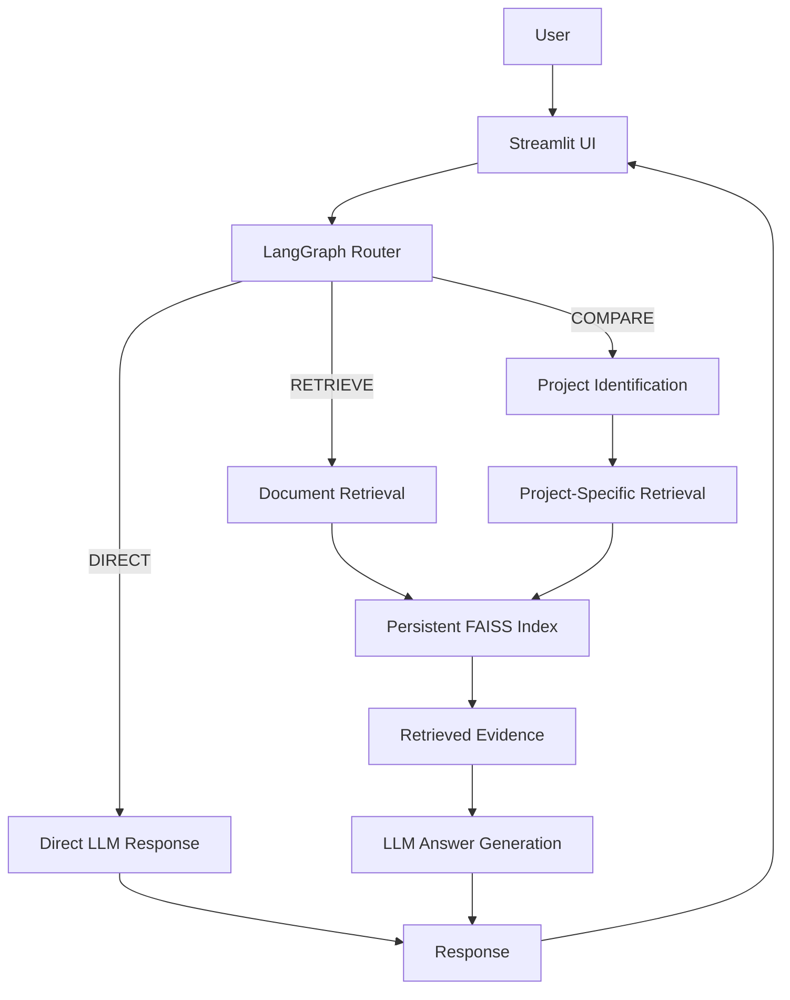
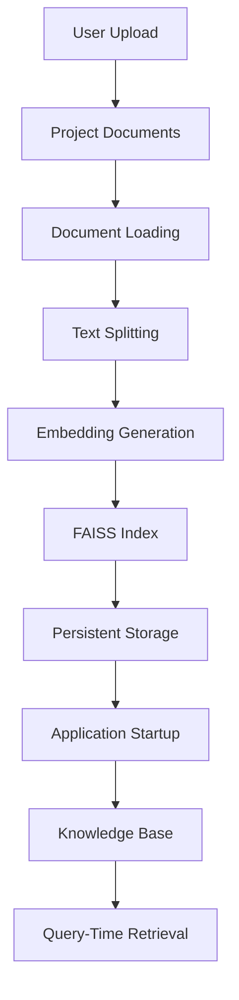
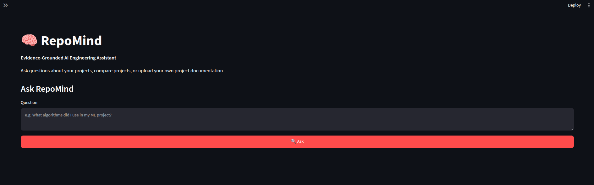

# repomind
My first RAG project. Done at IITM for internships.


<!-- RECALL @ K = 80% -->

# 🧠 RepoMind — Evidence-Grounded AI Engineering Assistant

**RepoMind** is an AI-powered assistant that helps users understand, explore, and compare software projects through natural-language questions. It uses Retrieval-Augmented Generation (RAG) to ground its answers in project documentation, reducing unsupported claims and making its responses easier to verify.

Built using Python, LangChain, LangGraph, FAISS, and Streamlit, RepoMind supports project-aware retrieval, multi-project comparisons, and user-uploaded documentation with persistent vector indexes.

## ✨ Features

- **Evidence-grounded question answering:** Retrieve relevant project documentation and use it as context for LLM-generated answers.
- **Hybrid retrieval from scratch:** Combine dense vector retrieval with BM25 keyword retrieval using Reciprocal Rank Fusion (RRF).
- **Intelligent query routing:** Use LangGraph to route questions into `DIRECT`, `RETRIEVE`, or `COMPARE` workflows.
- **Project comparison:** Retrieve evidence from individual projects and generate structured comparisons.
- **Custom project uploads:** Upload PDF, Markdown, and text documents for any project through the Streamlit interface.
- **Persistent vector indexes:** Store FAISS indexes on disk and reuse them for subsequent queries, avoiding unnecessary document re-embedding.
- **Source-aware responses:** Preserve project and source metadata so retrieved evidence can be inspected.
- **Retrieval evaluation:** Evaluate the from-scratch retrieval implementation using Recall@K.

## 🏗️ Architecture

### High-level workflow



### Document ingestion and indexing



Document embeddings and index construction are ingestion-time operations. Persisted indexes are loaded for subsequent use, while incoming queries are embedded and searched against the existing vector indexes.

## 🔍 Query Routing

RepoMind uses LangGraph to select an appropriate workflow for each question.

| Route | Purpose | Example |
|---|---|---|
| `DIRECT` | Answer questions that do not require project documentation | What is the capital of Australia? |
| `RETRIEVE` | Answer questions using relevant project documents | What algorithms did I use in my ML project? |
| `COMPARE` | Retrieve evidence from multiple projects and compare them | Compare my ML project and compiler project. |

The retrieval workflows pass relevant document content to the LLM, which generates an answer grounded in the retrieved evidence.

## 🔎 Retrieval Pipeline

RepoMind includes a from-scratch RAG implementation to explore and evaluate the retrieval pipeline independently of a framework-based implementation.

### Dense retrieval

- Generate document and query embeddings through an embedding API.
- Store document vectors in FAISS.
- Retrieve semantically relevant chunks using vector similarity.

### Keyword retrieval

- Use BM25 to rank documents according to query-term relevance.
- Complement semantic retrieval with exact keyword matching.

### Hybrid retrieval

- Combine the rankings from dense retrieval and BM25.
- Apply Reciprocal Rank Fusion (RRF) to produce a unified ranking.

The project also includes a LangChain implementation using document loaders, text splitters, embeddings, and FAISS, with LangGraph coordinating the question-answering workflows.

## 📁 User-Uploaded Projects

RepoMind is not limited to a predefined collection of projects. Users can upload their own documentation through the Streamlit interface.

Supported formats:

- PDF (`.pdf`)
- Markdown (`.md`)
- Plain text (`.txt`)

The upload workflow is:

1. Enter a project name and select documents.
2. Load and split the documents into chunks.
3. Generate embeddings and build a FAISS index.
4. Save the index for future use.
5. Add the project to the running knowledge base.
6. Ask questions about the project or compare it with other available projects.

This allows RepoMind to support different projects without requiring changes to the retrieval or question-answering logic.

## 📊 Evaluation

The from-scratch RAG implementation was evaluated using a custom, rule-based evaluation pipeline.

For each test question, the evaluation checks two conditions:

- **Answer keyword correctness:** All expected keywords must appear in the generated answer.
- **Project retrieval correctness:** All expected projects must be represented in the retrieved results.

A question is considered a pass only when both conditions are satisfied.

The overall evaluation pass rate is calculated as:

$$
\text{Pass Rate} =
\frac{\text{Number of questions passed}}
{\text{Total number of questions}}
\times 100\%
$$

The test code is run 5 times. The pass ratios are 80%, 100%, 100%, 100% and 100%. Hence the mean pass ratio is 96%.

**Reported result: 96% mean evaluation pass rate.**

This metric provides a simple measure of end-to-end performance across retrieval and answer generation. However, it is a custom evaluation metric rather than a standard retrieval metric such as Recall@K. Keyword matching also does not guarantee that an answer is factually correct or fully supported by the retrieved evidence.

## 🛠️ Tech Stack

| Component | Technology |
|---|---|
| Language | Python |
| User interface | Streamlit |
| API | FastAPI |
| LLM integration | OpenAI-compatible API through OpenRouter |
| Embeddings | NVIDIA Nemotron embedding model through OpenRouter |
| Vector database | FAISS |
| Keyword retrieval | BM25 |
| RAG framework | LangChain |
| Agentic workflow orchestration | LangGraph |
| PDF processing | PyPDF / LangChain document loaders |
| Evaluation | Pass Rate |

## 📂 Project Structure

The repository is organized to separate the application, retrieval implementations, LangChain/LangGraph components, and tests.

```text
repomind/
├── data/
│   ├── documents/          # Built-in project documentation
│   ├── index/              # From-scratch retrieval index
│   ├── lang_index/         # Persistent LangChain FAISS index
│   └── user_projects/      # Uploaded project documents and indexes
├── src/                    # From-scratch RAG implementation
├── lang/                   # LangChain and LangGraph components
├── tests/                  # Tests and evaluation scripts
├── app.py                  # Streamlit application
├── api.py                  # FastAPI application
├── build_index.py          # From-scratch index construction
├── chat.py                 # From-scratch CLI interface
├── requirements.txt        # Python dependencies
├── .env.example             # Environment variable template
└── README.md
```

*Directory contents may vary slightly depending on the final repository cleanup.*

## 🚀 Getting Started

### 1. Clone the repository

```bash
$ git clone <YOUR_REPOSITORY_URL>
$ cd repomind
```

### 2. Create a virtual environment

```bash
$ python3 -m venv .venv
$ source .venv/bin/activate
```

On Windows, activate it with:

```powershell
> .venv\Scripts\activate
```

### 3. Install dependencies

```bash
$ pip install -r requirements.txt
```

### 4. Configure API credentials

Create a `.env` file in the repository root:

```env
OPENROUTER_API_KEY=your_openrouter_api_key
```

Use an appropriate OpenRouter API key and ensure the configured embedding and generation models are available to your account.

**Security:** Never commit `.env` or expose API keys in source code, screenshots, or public repositories.

### 5. Prepare the indexes

If the persistent indexes have already been generated and are available locally, RepoMind can load them at application startup.

For a fresh setup, build the required indexes using the repository's ingestion/index-building functions. The from-scratch index and LangChain index are separate implementations; ensure the index required by the selected workflow exists.

### 6. Launch the Streamlit application

```bash
streamlit run app.py
```

Open the local URL printed by Streamlit, typically `http://localhost:8501`.

You can select questions to ask, inspect retrieved evidence, and upload documentation for additional projects.

### 7. Run the FastAPI service (optional)

The repository also retains a FastAPI implementation of the from-scratch RAG workflow.

Start it with:

```bash
uvicorn api:app --reload
```

Open the interactive API documentation at:

```text
http://127.0.0.1:8000/docs
```

The current Streamlit interface uses the LangGraph implementation; the FastAPI service remains available independently.

## 🧪 Running Tests

Run the project's tests from the repository root using the test commands like the one below.

For example, `test_graph.py` can be run using:
``` bash
$ python3 -m tests.test_graph
```

## 💡 Example Questions

Try asking RepoMind:

- What algorithms did I use in my ML project?
- What technologies are used in my compiler project?
- Compare my ML project and compiler project.
- What is the purpose of the uploaded project?
- Which technologies are mentioned in the uploaded documentation?

Answers depend on the information present in the indexed documents.

## 🔮 Future Improvements

Potential directions for further development include:

- More comprehensive retrieval and answer-quality evaluation.
- Reranking retrieved documents before generation.
- More robust citation generation and claim-level evidence verification.
- Incremental indexing when documents are added or updated.
- Support for additional document formats and source-code repositories.
- Improved handling of large collections of projects.
- Automated evaluation of answer faithfulness and retrieval relevance.

## 🎯 Learning Outcomes

This project demonstrates practical experience with:

- Implementing RAG from scratch.
- Dense and sparse information retrieval.
- Hybrid ranking with Reciprocal Rank Fusion.
- Embedding-based semantic search and FAISS.
- Framework-based RAG using LangChain.
- Conditional workflows and routing with LangGraph.
- Persistent vector indexes and document ingestion pipelines.
- Evaluation of retrieval performance.
- Building an interactive AI application with Streamlit and FastAPI.

---

**RepoMind — turning project documentation into searchable, evidence-grounded knowledge.**

**NOTE**:
- The uploads are directly done to a folder (data/) in the project.
- The from scratch implementation is not used in the web application but it can be tested and using some codes in the tests directory.


**Webpage**:

